# 🦖 ARK Admin Manager

**Kompleksowy menedżer serwerów ARK: Survival Evolved (ASE) i ARK: Survival Ascended (ASA)**
*Comprehensive server manager for ARK: Survival Evolved (ASE) & ARK: Survival Ascended (ASA)*

> 📖 **Pełna dokumentacja (PL + EN) / Full documentation (PL + EN):** [DOCUMENTATION.md](DOCUMENTATION.md) · [CHANGELOG.md](CHANGELOG.md)

| | |
|---|---|
| Wersja / Version | 1.0.28 |
| Data build / Build date | 2026-09-07 |
| Autor / Author | Kruzio |
| Licencja / License | MIT |
| Framework | Electron 33.x + Node.js 20.x |
| Instalator / Installer | electron-builder 25 (NSIS + Portable) |
| Baza danych / Database | SQLite (sql.js — WASM) |
| Język UI / UI language | PL/ENG (przełącznik w górnym pasku / switch in the top bar) |

---

## 📖 Opis projektu / Project description

**PL:** ARK Admin Manager to aplikacja desktopowa (Electron) do zarządzania dedykowanymi serwerami ARK na Windows. Obsługuje **obie generacje gry**:

- **ASE** — ARK: Survival Evolved (AppID `376030`, Steam Workshop, `ShooterGameServer.exe`)
- **ASA** — ARK: Survival Ascended (AppID `2430930`, CurseForge, `ArkAscendedServer.exe`)

Projekt powstał jako nowoczesna, ulepszona reimplementacja klasycznego **ARK Server Manager (ASM)** — referencyjnego narzędzia .NET. Wszystkie funkcje ASM mają być odtworzone i rozszerzone.

**EN:** ARK Admin Manager is a desktop (Electron) application for managing dedicated ARK servers on Windows. It supports **both generations of the game**:

- **ASE** — ARK: Survival Evolved (AppID `376030`, Steam Workshop, `ShooterGameServer.exe`)
- **ASA** — ARK: Survival Ascended (AppID `2430930`, CurseForge, `ArkAscendedServer.exe`)

The project is a modern, improved reimplementation of the classic **ARK Server Manager (ASM)** — a reference .NET tool. All ASM features are meant to be recreated and extended.

---

## 📸 Screenshots / Zrzuty ekranu

<div align="center">
  <a href="images/a1.png">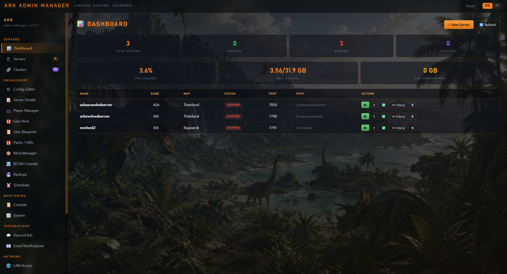</a>
  <a href="images/a2.png">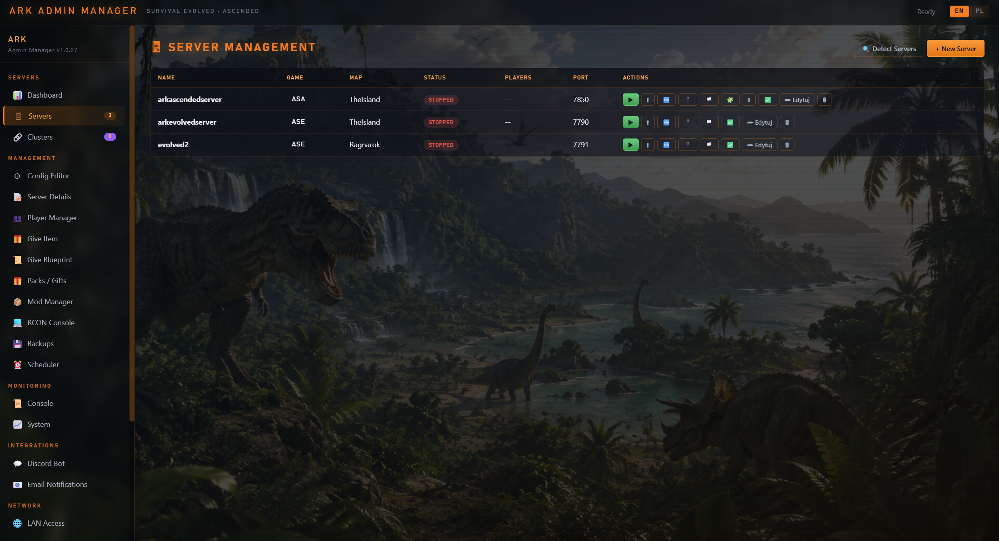</a>
  <a href="images/a3.png">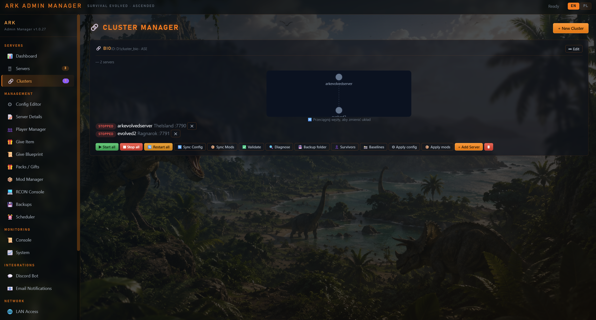</a>
  <a href="images/a4.png">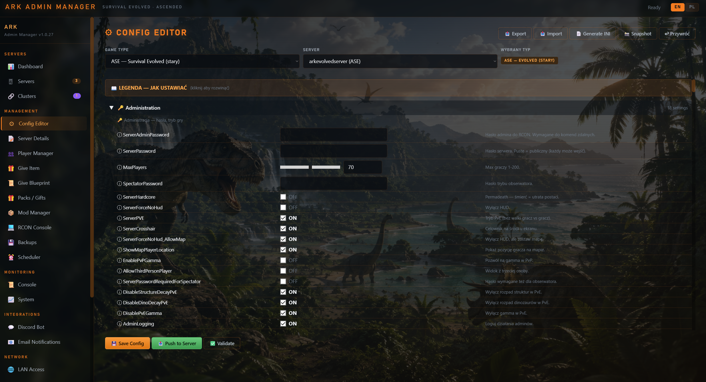</a>
  <a href="images/a5.png">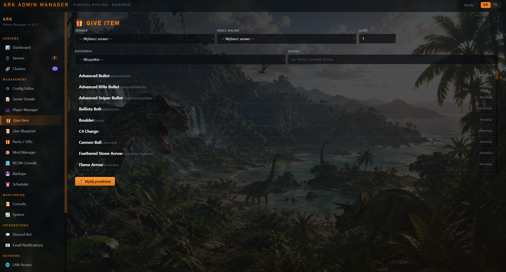</a>
  <a href="images/a6.png">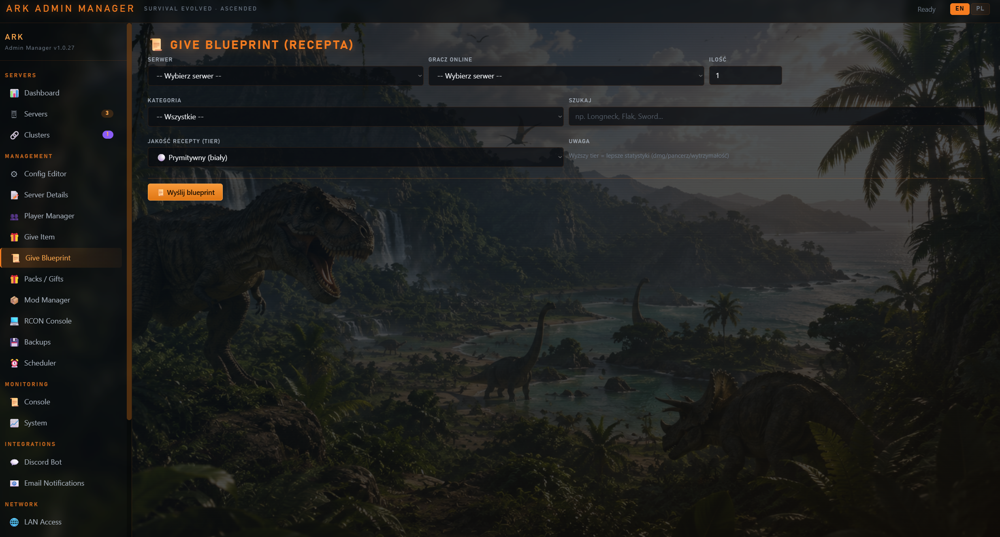</a>
  <a href="images/a7.png">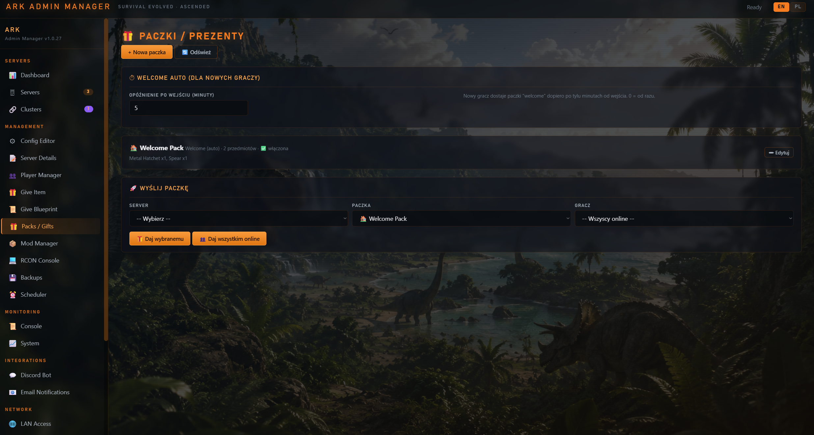</a>
  <a href="images/a8.png">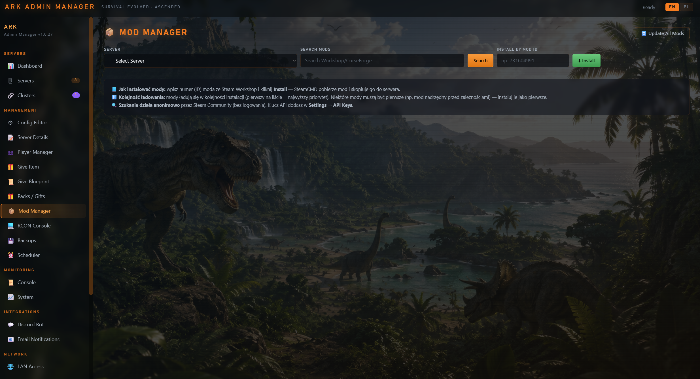</a>
  <a href="images/a9.png">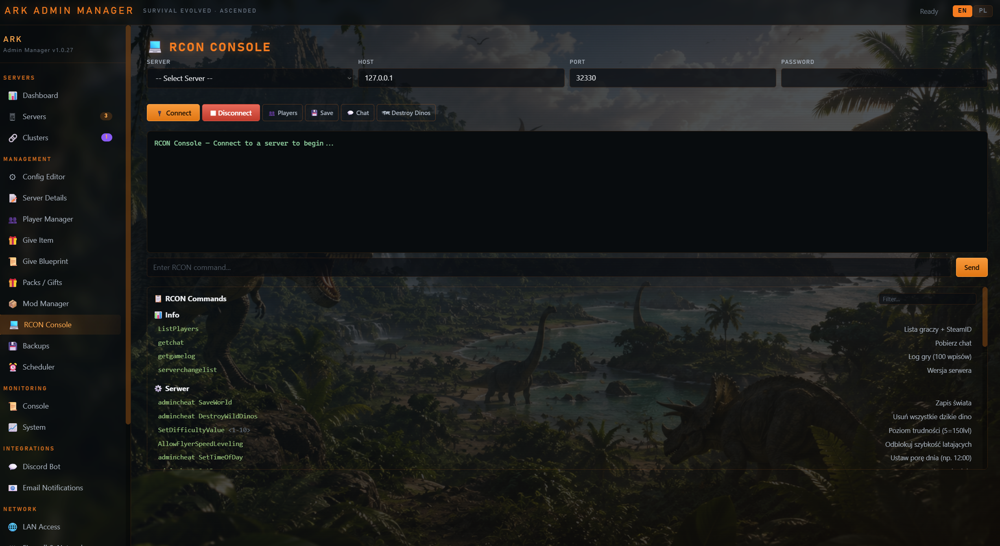</a>
  <a href="images/a10.png">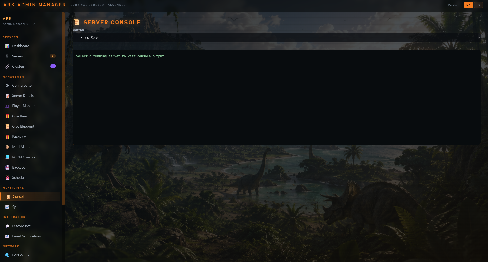</a>
  <a href="images/a11.png">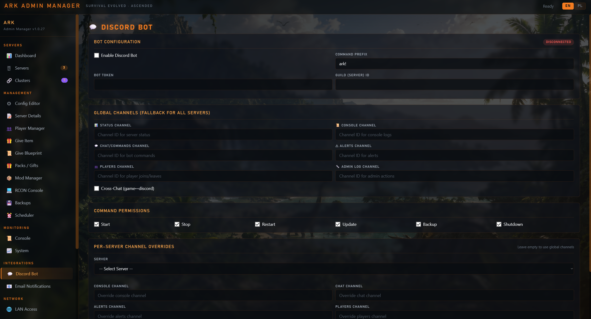</a>
  <a href="images/a12.png">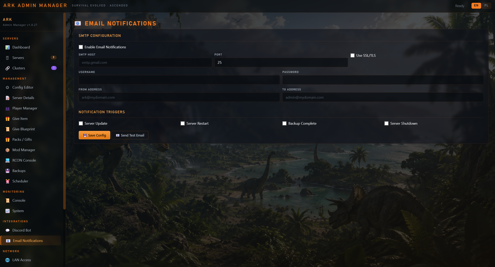</a>
  <a href="images/a13.png">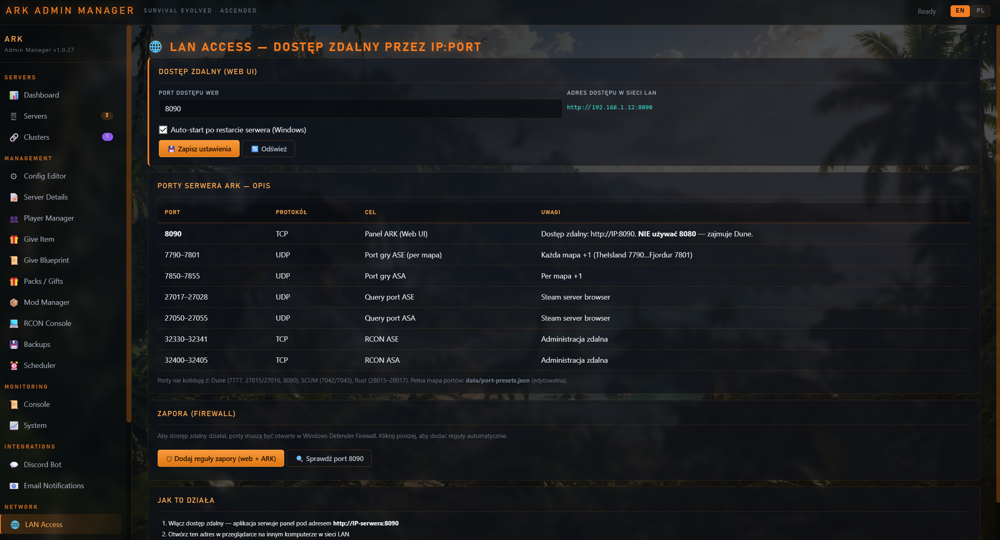</a>
</div>

Kliknij obraz, aby powiększyć / Click an image to enlarge.

---

## 🏗️ Architektura / Architecture

```
ArkAdminManager/
├── main.js                  # Electron main — ładuje backendy BEZPOŚREDNIO + IPC handlers
├── preload.js               # contextBridge → window.api.invoke / window.api.on
├── dev-server.js            # Express (port 3000) — TYLKO tryb dev (npm run dev)
├── version.json             # Manifest wersji i lista funkcji
├── package.json             # Build config (electron-builder)
│
├── assets/                  # Ikony (icon.ico)
├── data/                    # Dane startowe kopiowane do AppData przy 1. uruchomieniu
│   ├── ark_admin.db         # Pusta baza SQLite (schema)
│   ├── gamedata/            # 12 plików *.gamedata map ASE (TheIsland…Fjordur)
│   └── templates/           # Szablony
│
└── src/
    ├── games/
    │   └── game-registry.js # Definicje ASE + ASA (mapy, porty, AppID, sekcje INI)
    ├── backend/             # 14 modułów backendowych
    │   ├── database.js
    │   ├── server-manager.js
    │   ├── steamcmd.js
    │   ├── rcon.js
    │   ├── config-parser.js
    │   ├── config-descriptions.js
    │   ├── mod-manager.js
    │   ├── cluster-manager.js
    │   ├── backup-service.js
    │   ├── scheduler.js
    │   ├── discord-bot.js
    │   ├── email-service.js
    │   ├── system-monitor.js
    │   └── firewall-manager.js
    └── ui/
        ├── index.html       # Całe UI: 2208 linii, 19 paneli
        └── css/main.css     # Style (ciemny motyw)
```

**EN:** Key structure:

- `main.js` — Electron main process; loads the backend modules directly and registers the IPC handlers.
- `preload.js` — `contextBridge` exposing `window.api.invoke` / `window.api.on`.
- `dev-server.js` — Express server (port 3000), dev mode only (`npm run dev`).
- `data/` — initial data copied to `%APPDATA%` on first run (empty SQLite schema, 12 ASE map `*.gamedata` files, templates).
- `src/games/game-registry.js` — ASE + ASA definitions (maps, ports, AppID, INI sections).
- `src/backend/` — 14 backend modules (database, server-manager, steamcmd, rcon, config parser, mods, clusters, backups, scheduler, Discord bot, e-mail, monitoring, firewall).
- `src/ui/` — the entire UI (`index.html`, 19 panels) with a dark theme (`main.css`).

### Przepływ danych / Data flow
```
index.html (fetch→IPC bridge) ──► window.api.invoke(channel, ...args)
        ──► preload.js (contextBridge) ──► ipcMain.handle(...) w main.js
        ──► moduł backendu ──► SQLite (sql.js) / SteamCMD / RCON / system
```

**EN:** `index.html` (fetch → IPC bridge) → `window.api.invoke(channel, ...args)` → `preload.js` (contextBridge) → `ipcMain.handle(...)` in `main.js` → backend module → SQLite (sql.js) / SteamCMD / RCON / system.

### Katalogi runtime / Runtime directories
```
%APPDATA%\ArkAdminManager\
├── ark_admin.db        # baza (kopiowana z data/ przy 1. uruchomieniu)
├── logs\               # startup.log (crash logger)
├── backups\            # backupy serwerów
├── gamedata\           # dane map
└── templates\          # szablony
```

**EN:** `ark_admin.db` — database (copied from `data/` on first run); `logs\` — `startup.log` (crash logger); `backups\` — server backups; `gamedata\` — map data; `templates\` — templates.

**SteamCMD i serwery — konfigurowalne w panelu Settings (domyślnie) / SteamCMD and servers — configurable in the Settings panel (defaults):**
```
D:\steamcmd          # SteamCMD (AppID 376030/2430930)
D:\                  # katalog serwerów — każdy serwer w OSOBNYM folderze
D:\arkevolvedserver  # ARK: Survival Evolved
D:\scumserver        # SCUM (inna gra — ignorowane przez ARK Admin)
D:\duneserver        # Dune (NIE ruszane przez aplikację)
```

> **EN:** `D:\steamcmd` — SteamCMD; `D:\` — servers directory (each server in its own folder); `D:\arkevolvedserver` — ARK: Survival Evolved; `D:\scumserver` / `D:\duneserver` — other games, ignored by ARK Admin.

> SteamCMD i serwery mogą być na **RÓŻNYCH dyskach** — SteamCMD instaluje pliki serwera do `Install Path` (`+force_install_dir`), niezależnie od swojej lokalizacji.
> **EN:** SteamCMD and the servers can be on **different drives** — SteamCMD installs server files to the `Install Path` (`+force_install_dir`) regardless of its own location.

---

## 🎮 Obsługiwane gry / Supported games

| | ASE (Survival Evolved) | ASA (Survival Ascended) |
|---|---|---|
| Steam AppID | `376030` | `2430930` |
| Exe | `ShooterGameServer.exe` | `ArkAscendedServer.exe` |
| Mod system / System modów | Steam Workshop (`346110`) | CurseForge |
| Port domyślny (baza) / Default port (base) | 7790 (UDP) | 7850 (UDP) |
| Query port (baza) / Query port (base) | 27017 (UDP) | 27050 (UDP) |
| RCON port (baza) / RCON port (base) | 32330 (TCP) | 32400 (TCP) |
| Ścieżka configu / Config path | `ShooterGame/Saved/Config/WindowsServer` | same / j.w. |

> ⚠️ **Porty dobrane tak, aby NIE kolidować z innymi grami / Ports chosen so they do NOT collide with other games:**
> - Dune Awakening: 7777 UDP game, 27015/27016 UDP query, 7778–7787 UDP multi-sietch, 8080/3000/3001 TCP
> - SCUM: 7042/7043 · Rust: 28015–28017

### 🔌 Porty per-mapa (edytowalne, NIE hardkodowane) / Per-map ports (editable, NOT hardcoded)

**PL:** Każda mapa ma własny domyślny zestaw portów, zdefiniowany w **`data/port-presets.json`** (edytowalny plik konfiguracyjny — zmieniaj ręcznie na własne potrzeby; przy publikacji na GitHub można nadać inne wartości).

**EN:** Each map has its own default port set, defined in **`data/port-presets.json`** (an editable config file — change it manually to fit your needs; different values may be used when publishing to GitHub).

- ASE: `7790–7801` game, `27017–27028` query, `32330–32341` RCON
- ASA: `7850–7855` game, `27050–27055` query, `32400–32405` RCON

**PL:** W formularzu tworzenia serwera pola portów **auto-wypełniają się** po wyborze gry i mapy — i pozostają **w pełni edytowalne**.

**EN:** In the create-server form the port fields **auto-fill** after choosing the game and map — and remain **fully editable**.

**Mapy ASE / ASE maps:** The Island, The Center, Scorched Earth, Ragnarok, Aberration, Extinction, Valguero, Genesis, Crystal Isles, Genesis 2, Lost Island, Fjordur.

**Mapy ASA / ASA maps:** The Island, Scorched Earth, The Center, Aberration, Extinction, Club ARK.

---

## 🧩 Funkcje (19 paneli) / Features (19 panels)

| Panel | Funkcje / Features |
|---|---|
| 📊 Dashboard | Przegląd serwerów, statusy, szybkie akcje<br><i>Server overview, statuses, quick actions</i> |
| 🖥 Servers | CRUD + **Start / Stop / Restart / Install / Update / Validate** + **🔍 Detect Servers** (auto-wykrywanie istniejących serwerów na `D:\`)<br><i>CRUD + Start/Stop/Restart/Install/Update/Validate + Detect Servers (auto-discovery of existing servers on `D:\`)</i> |
| 🔗 Clusters | Klastry cross-ARK, sync configu, walidacja<br><i>Cross-ARK clusters, config sync, validation</i> |
| ⚙ Config Editor | Pełny edytor `Game.ini` + `GameUserSettings.ini` — tryb INI MERGE (nie nadpisuje całego pliku)<br><i>Full `Game.ini` + `GameUserSettings.ini` editor — INI MERGE mode (does not overwrite the whole file)</i> |
| 📝 Server Details | Szczegóły, status, gracze, uptime<br><i>Details, status, players, uptime</i> |
| 👥 Player Manager | Zarządzanie graczami (whitelist/ban)<br><i>Player management (whitelist/ban)</i> |
| 📦 Mod Manager | Instalacja/usuwanie/aktualizacja modów (ASE Workshop)<br><i>Install/remove/update mods (ASE Workshop)</i> |
| 💻 RCON Console | Uniwersalny RCON (Source RCON protocol) — komendy, broadcast, save, gracze<br><i>Universal RCON (Source RCON protocol) — commands, broadcast, save, players</i> |
| 💾 Backups | Backupy ZIP serwerów, przywracanie, harmonogram<br><i>ZIP server backups, restore, schedule</i> |
| ⏰ Scheduler | Zadania cron (update/backup/restart/shutdown/start/broadcast/dino wipe/save)<br><i>Cron jobs (update/backup/restart/shutdown/start/broadcast/dino wipe/save)</i> |
| 📜 Console | Podgląd logów serwera (`ShooterGame/Saved/Logs`)<br><i>Server log viewer (`ShooterGame/Saved/Logs`)</i> |
| 📈 System | CPU/RAM/Dysk/Sieć + historia<br><i>CPU/RAM/Disk/Network + history</i> |
| 💬 Discord Bot | Bot Discord.js v14, konfigurowalne kanały (1-3)<br><i>Discord.js v14 bot, configurable channels (1–3)</i> |
| 📧 Email | Powiadomienia e-mail<br><i>E-mail notifications</i> |
| 🛡 Firewall & Network | Windows Firewall (netsh), auto IP publiczne, reguły portów<br><i>Windows Firewall (netsh), auto public IP, port rules</i> |
| 🔄 Profile Sync | Synchronizacja konfiguracji między serwerami<br><i>Config synchronization between servers</i> |
| ⬆ Auto-Update | Automatyczne aktualizacje serwerów<br><i>Automatic server updates</i> |
| 📁 Server Files | Przeglądarka i edytor plików serwera<br><i>Server file browser and editor</i> |
| 🔧 Settings | Ustawienia globalne (SteamCMD, ścieżki)<br><i>Global settings (SteamCMD, paths)</i> |

### Backend — 14 modułów / modules
`database.js` (SQLite/sql.js) · `server-manager.js` (cykl życia + monitor statusu / lifecycle + status monitor) · `steamcmd.js` (instalacja/update SteamCMD + serwery / SteamCMD + server install/update) · `rcon.js` (Source RCON) · `config-parser.js` (INI merge + sekcje ASM / INI merge + ASM sections) · `config-descriptions.js` (opisy opcji / option descriptions) · `mod-manager.js` · `cluster-manager.js` · `backup-service.js` · `scheduler.js` · `discord-bot.js` · `email-service.js` · `system-monitor.js` · `firewall-manager.js`

---

## 🚀 Uruchamianie i build / Running and building

### Szybka instalacja / Quick install

**PL:** Gotowy instalator znajduje się w osobnym folderze [`installer/`](installer/):

- **`installer/ARK Admin Manager Setup 1.0.28.exe`** — instalator NSIS (x64)

Pobierz i uruchom plik `.exe` — instalator zainstaluje aplikację per-machine (wymaga uprawnień administratora) i utworzy skróty na pulpicie oraz w menu Start. Wersję portable budujesz komendą `npm run build:portable` (szczegóły niżej).

**EN:** The ready-to-use installer is in a separate folder [`installer/`](installer/):

- **`installer/ARK Admin Manager Setup 1.0.28.exe`** — NSIS installer (x64)

Download and run the `.exe` — the installer performs a per-machine install (requires administrator privileges) and creates desktop and Start Menu shortcuts. The portable build is produced with `npm run build:portable` (details below).

### Wymagania / Requirements
- Node.js 20.x + npm
- Windows (aplikacja zarządza serwerami Windows / the app manages Windows servers)

### Dev
```powershell
cd ArkAdminManager  # folder ze sklonowanym repozytorium / cloned repo folder
npm install
npm run dev        # Express na http://localhost:3000 + Electron
# lub / or
npm start          # Electron bezpośrednio (loadFile index.html) / Electron directly
```

### Build instalatora / Building the installer
```powershell
npm run build:installer   # NSIS (x64) + Portable (x64)
```

**Wynik build / Build output** (zgodnie z `build.directories.output`):
```
Ark_admin_Manager_instalator_1.0.28\
├── ARK Admin Manager Setup 1.0.28.exe   # instalator NSIS / NSIS installer
├── ARK Admin Manager 1.0.28.exe         # wersja portable / portable version
├── ARK Admin Manager Setup 1.0.28.exe.blockmap
├── builder-debug.yml
├── builder-effective-config.yaml
└── win-unpacked\                       # rozpakowana wersja do testów / unpacked test build
```

> ⚠️ **Ważne / Important:** nowe wersje buduj zawsze z folderu projektu — output trafia do `Ark_admin_Manager_instalator_<wersja>` (wersjonowany folder, np. `_1.0.28`). Przy zmianie wersji podbij `version` w `package.json` i `version.json`. Buduj przez `npm.cmd run build:installer`.
> **EN:** Always build new versions from the project folder — output goes to `Ark_admin_Manager_instalator_<version>` (a versioned folder, e.g. `_1.0.28`). When changing the version, bump `version` in `package.json` and `version.json`. Build with `npm.cmd run build:installer`.

### Konfiguracja instalatora / Installer configuration (package.json → build)
- `appId`: `com.arkadmin.manager`
- `productName`: `ARK Admin Manager`
- `win.target`: NSIS + Portable (x64)
- `requestedExecutionLevel`: `highestAvailable` (uruchamianie jako administrator / run as administrator)
- `nsis.perMachine`: `true` (instalacja dla wszystkich użytkowników → Program Files / install for all users)
- `nsis.allowToChangeInstallationDirectory`: `true` (domyślnie Program Files / Program Files by default)
- `extraResources`: kopiuje `data/` do zasobów aplikacji / copies `data/` into the app resources

---

## 🌐 Sieć i dostęp zdalny (IP:port) / Network and remote access

**PL:** Aplikacja jest **natywną aplikacją desktopową** (Electron), więc domyślnie działa lokalnie na maszynie, na której jest zainstalowana.

**EN:** The app is a **native desktop application** (Electron), so by default it runs locally on the machine where it is installed.

**Plan instalacji na serwerze (Windows) / Server install plan (Windows):**
1. Zainstaluj `ARK Admin Manager Setup 1.0.28.exe` na serwerze (Windows). / Install `ARK Admin Manager Setup 1.0.28.exe` on the server (Windows).
2. Uruchom jako administrator. / Run as administrator.
3. Zarządzaj serwerami ASE/ASA lokalnie na serwerze. / Manage ASE/ASA servers locally on the server.

**Dostęp zdalny w sieci LAN / Remote access on the LAN** — opcje / options:
- **RDP** — podłącz się do serwera przez Pulpit zdalny i używaj aplikacji tak, jak lokalnie. / Connect to the server via Remote Desktop and use the app as if locally.
- **Web UI (zaimplementowane / implemented)** — wbudowany serwer Express w `main.js` na porcie **8090** (0.0.0.0). Dostęp przez przeglądarkę: `http://IP_SERWERA:8090`. Pełne REST API: `POST /api/invoke` z `{channel, args}` + `GET /api/health`. Port zmienisz w Settings → Remote Access. / Built-in Express server in `main.js` on port **8090** (0.0.0.0). Browser access: `http://SERVER_IP:8090`. Full REST API: `POST /api/invoke` with `{channel, args}` + `GET /api/health`. Change the port in Settings → Remote Access.

### Porty do otwarcia w zaporze (serwer) / Ports to open in the firewall (server)
| Port | Protokół / Protocol | Cel / Purpose |
|---|---|---|
| 7790 | UDP | Port gry ARK / ARK game port |
| 27017 | UDP | Query port |
| 32330 | TCP | RCON |
| 3000 | TCP | (opcjonalnie / optional) Web UI |

**PL:** Panel **Firewall & Network** automatyzuje dodawanie reguł dla portów gry/query/RCON.
**EN:** The **Firewall & Network** panel automates adding rules for the game/query/RCON ports.

---

## 🔍 Wykrywanie serwerów na dysku D / Detecting servers on drive D

**✅ Auto-detekcja / Auto-detection (przycisk „🔍 Detect Servers” w panelu Servers / the "🔍 Detect Servers" button in the Servers panel):**

- Skanuje `D:\` (oraz `C:\ARK`, `C:\ark`, `C:\Servers`) w poszukiwaniu folderów zawierających exe serwera ARK. / Scans `D:\` (and `C:\ARK`, `C:\ark`, `C:\Servers`) for folders containing an ARK server exe.
- Wykrywa ASE (`ShooterGameServer.exe`) i ASA (`ArkAscendedServer.exe`). / Detects ASE (`ShooterGameServer.exe`) and ASA (`ArkAscendedServer.exe`).
- **READ-ONLY** — nic nie modyfikuje na dysku, tylko dodaje serwery do bazy aplikacji. / **READ-ONLY** — changes nothing on disk, only adds servers to the app database.
- **Automatycznie pomija** foldery nie-ARK (`duneserver`, `scumserver`, `backup`, `Narzędzia` itp.) — nie mają one plików `ShooterGame\Binaries\Win64\*.exe`. / **Automatically skips** non-ARK folders (`duneserver`, `scumserver`, `backup`, `Narzędzia`, etc.) — they have no `ShooterGame\Binaries\Win64\*.exe` files.

**Wykrywanie działających procesów / Running-process detection:** `tasklist` (`ShooterGameServer.exe` / `ArkAscendedServer.exe`) — `syncLiveStatus()` przy starcie i co 30 s / on startup and every 30 s.

Struktura folderu serwera wymagana przez aplikację / Required server folder structure:
```
<folder>\ShooterGame\Binaries\Win64\ShooterGameServer.exe   (ASE)
<folder>\ShooterGame\Binaries\Win64\ArkAscendedServer.exe   (ASA)
<folder>\ShooterGame\Saved\Config\WindowsServer\Game.ini
<folder>\ShooterGame\Saved\Config\WindowsServer\GameUserSettings.ini
```

---

## ⚙️ Format startu serwera (launch args) / Server launch args format

**PL:** `_buildLaunchArgs()` buduje argument w formacie ARK:

**EN:** `_buildLaunchArgs()` builds the argument in the ARK format:

```
TheIsland?listen?Port=7790?QueryPort=27017?RCONPort=32330?RCONEnabled=True?SessionName=xxx -server -log
```
- ASA: mapy z sufiksem `_WP` (np. `TheIsland_WP`), `-WinLiveMaxPlayers=`, `-ClusterIdOverride=`. / ASA: maps with the `_WP` suffix (e.g. `TheIsland_WP`), `-WinLiveMaxPlayers=`, `-ClusterIdOverride=`.
- ASE: `RCONEnabled=True`, `ClusterDirOverride=`.
- Uruchamianie przez **dwa pliki BAT** (sprawdzone rozwiązanie): BAT menedżera otwiera BAT serwera w osobnym oknie `cmd /k` — okno pozostaje otwarte po zatrzymaniu. / Launching via **two BAT files** (a proven solution): the manager BAT opens the server BAT in a separate `cmd /k` window — the window stays open after stopping.

---

## 📦 Moduły i zależności / Modules and dependencies

| Zależność / Dependency | Cel / Purpose |
|---|---|
| `sql.js` | SQLite w WASM / SQLite in WASM |
| `discord.js` | Bot Discord / Discord bot |
| `express` | Dev server |
| `ini` | Parsowanie INI / INI parsing |
| `node-cron` | Harmonogramy / schedules |
| `systeminformation` | Monitoring systemu / system monitoring |
| `portfinder` | Wyszukiwanie wolnych portów / finding free ports |
| `extract-zip` | Rozpakowywanie (SteamCMD) / unzipping (SteamCMD) |
| `ws` | WebSocket |

Dev: `electron`, `electron-builder`.

---

## 📜 Historia prac i naprawione błędy / Work history and fixed bugs

**PL:** Pełna historia rozwoju znajduje się w **historii sesji Copilot** (sesja `74cc03da-8652-4771-b95d-7ea88e71200f`, 52 tury). Kluczowe kamienie milowe:

**EN:** The full development history is in the **Copilot session history** (session `74cc03da-8652-4771-b95d-7ea88e71200f`, 52 turns). Key milestones:

1. ✅ Analiza referencyjnego ASM (`.NET`, `ARK sources`) + repo GitHub / Analysis of the reference ASM (`.NET`, `ARK sources`) + GitHub repo
2. ✅ Instalator NSIS + Portable (fix: dwa pliki, launch po instalacji, Program Files) / NSIS + Portable installer (fix: two files, launch after install, Program Files)
3. ✅ Uruchamianie jako administrator (`highestAvailable`) / Running as administrator (`highestAvailable`)
4. ✅ Działające linki zewnętrzne (`shell:openExternal`) / Working external links (`shell:openExternal`)
5. ✅ Tworzenie serwera → uruchomienie SteamCMD (instalacja na dysku) / Server creation → SteamCMD launch (on-disk install)
6. ✅ Funkcja Update (fix: błąd `AppID:` w BAT — dwukropek interpretowany jako dysk) / Update function (fix: `AppID:` BAT bug — colon interpreted as a drive)
7. ✅ RCON (Source RCON protocol) + konsola serwera (odczyt `Saved/Logs`) / RCON (Source RCON protocol) + server console (reading `Saved/Logs`)
8. ✅ Discord Bot — konfigurowalne kanały (1–3) / Discord Bot — configurable channels (1–3)
9. ✅ Firewall & Network — reguły netsh + auto public IP / Firewall & Network — netsh rules + auto public IP
10. ✅ Config Editor — widok listy, kategorie, opisy opcji / Config Editor — list view, categories, option descriptions
11. ✅ Fix: `UNIQUE constraint failed: server_messages.server_id`
12. ✅ Fix: pole nazwy serwera wyszarzone / Fix: server name field greyed out
13. ✅ **Start serwera** — fix: exit code 0 → podejście z dwoma BAT (finalnie działa) / **Server start** — fix: exit code 0 → two-BAT approach (finally works)

---

## ✅ Status / TODO

**Działa / Working:** CRUD serwerów, start/stop/restart, instalacja/update/validate (SteamCMD), config editor (INI merge), RCON, backupy, scheduler, monitoring, Discord, firewall, gamedata. / Server CRUD, start/stop/restart, install/update/validate (SteamCMD), config editor (INI merge), RCON, backups, scheduler, monitoring, Discord, firewall, gamedata.

**Do rozbudowy / To be extended:**
- [ ] Auto-skanowanie dysku D w poszukiwaniu istniejących serwerów ASE/ASA / Auto-scanning drive D for existing ASE/ASA servers
- [ ] Web UI przez `http://IP_SERWERA:3000` (mapowanie IPC → REST + auth) / Web UI via `http://SERVER_IP:3000` (IPC → REST mapping + auth)
- [ ] Mod Manager ASA (CurseForge — obecnie tylko ASE Workshop) / ASA Mod Manager (CurseForge — currently only ASE Workshop)
- [ ] Pełne odwzorowanie wszystkich opcji ASM (cel projektu) / Full recreation of all ASM options (project goal)
